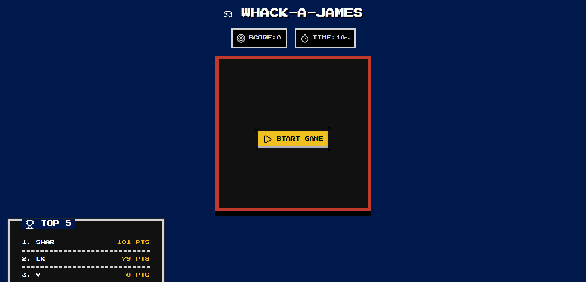

# Whack-A-James (Arcade Reflex Clicker)

An 8-bit interactive web arcade game.

[](https://whack-a-james.onrender.com)


---

## Features
- **8-Bit Retro Aesthetic**: Built with the `nes.css` framework and the `Press Start 2P` font.
- **Dynamic Hammer Cursor**: Changes to a `🔨` over the board and tilts `-45°` when clicking.
- **Physical Game Juice**: Every hit triggers a violent screen shake and a gold **"SMASH!"** pop-up.
- **Python Backend**: Fast Flask API managing a persistent global top-5 SQLite leaderboard.

---

## Tech & Icon Stack
- **Frontend**: HTML5, CSS3, JavaScript (ES6+).
- **UI Framework**: NES.css (v2.3.0).
- **Icons**: Lucide Icons (`gamepad-2`, `target`, `timer`, `play`, `refresh-cw`, `trophy`).
- **Backend & Database**: Python 3, Flask, SQLite3, Gunicorn.

---

## Project Structure

```
📁 WhackAMole/
├── 📄 .gitignore          # Keeps local databases out of your commits
├── 📄 LICENSE             # Official open-source MIT legal protection
├── 📄 README.md           # Your sleek, 8-bit project overview with your live link
├── 📄 app.py              # Flask server and SQLite query architecture
├── 📄 index.html          # Retro NES game board framework, styling, and gameplay
└── 📄 requirements.txt    # Production packages (Flask + Gunicorn mapped out)
```

---

## Local Setup

```bash
# Clone and enter repo
git clone https://github.com/sharr-catalyst/WhackAMole.git
cd WhackAMole

# Setup environment & install packages
python -m venv venv
.\venv\Scripts\activate
pip install -r requirements.txt

# Run server
python app.py
```

---
